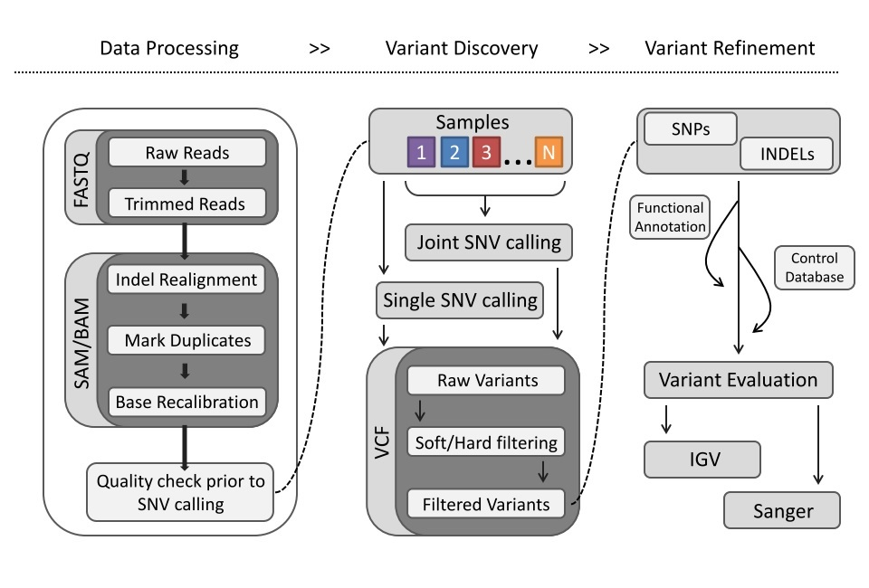
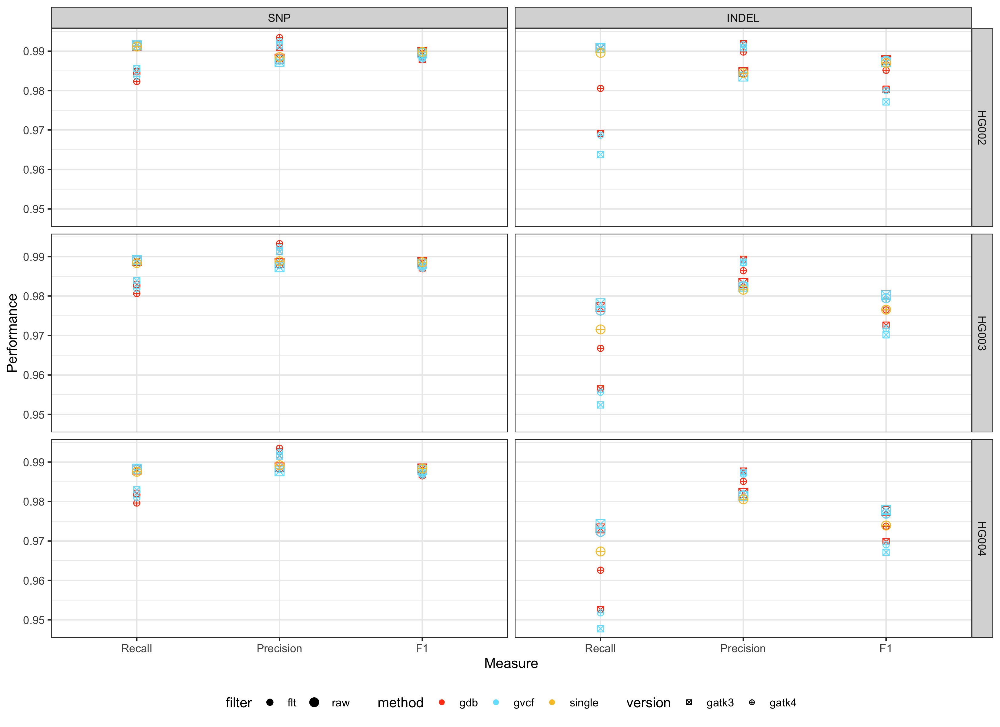

The Ashkenazim trio from [Genome in a
Bottle](http://jimb.stanford.edu/giab/) (GIAB) samples:

[HG002_NA24385_son](https://ftp-trace.ncbi.nlm.nih.gov/ReferenceSamples/giab/release/AshkenazimTrio/HG002_NA24385_son/)
[HG003_NA24149_father](https://ftp-trace.ncbi.nlm.nih.gov/ReferenceSamples/giab/release/AshkenazimTrio/HG003_NA24149_father/)
[HG004_NA24143_mother](https://ftp-trace.ncbi.nlm.nih.gov/ReferenceSamples/giab/release/AshkenazimTrio/HG004_NA24143_mother/)

DNA were procured from Coriell and sequenced at McGill on HiSeq X Ten

As depicted in the diagram above the each trio sample was processed as
follows:

Read processing

1.  Adapter and quality filtering of raw reads with skewer 0.2.2
2.  Alignment of trimmed reads to Genome Reference Consortium Human
    Build 38 (GRCh38) patch release 13 (GenBank GCA_000001405.28) with
    bwa+mem 0.7.15
3.  GATK 3.8 Indel realignment using both samples to refine indel
    regions
4.  Mark duplicates with picard 2.9.0
5.  Base recalibration of each samples with GATK 3.8.1

Variant calling

1.  For each sample variants were called using GATK 3 (version
    3.8-1-0-gf15c1c3ef) and GATK 4 (version 4.1.8.1) haplotype caller
    (HC)
2.  Single g.vcfs from both GATK3 HC and GATK4 HC were then merged using
    CombinedGVCF (gvcf label) using their associated GATK3 and GATK4
    version
3.  Single g.vcfs from GATK3 HC and GATK HC were also combined
    GenomicImportDB (gdb label; version 4.1.8.1)
4.  The final genotyped vcfs from both GATK3 and GATK4 callers were then
    filter with variant recalibator (version 3.8-1-0-gf15c1c3ef) using
    ts_filter_level of 99.95 for snps and 99.4 for indels
5.  Both raw and filter merged vcfs were split into individual trio
    samples using bcftools +split for benchmarking assessment

Benchmarking

1.  hap.py (v0.3.12) using vcfeval algorithm and the GRCh38 4.2.1 truth
    set

Results

1.  GATK3 is more sensitive than GATK4, whereas GATK4 is more precise
    than GATK3
2.  Comparing F1 score for methods for GATK4 single \> gdb == gvcf
3.  Comparing F1 for GATK3 gdb \> gvcf, where gdb method has slightly
    higher precision than gvcf method, and gvcf method has slightly
    higher sensitivity than gdb.  
4.  For GATK3 gdb != gvcf F1 score like in GATK4 like due to mixing of
    GATK3 and 4 versions. Also
    -allow-old-rms-mapping-quality-annotation-data argument needed to be
    added at genotyping step.
5.  VSQR filtering has larger impact on recall than precision
    particularly with Indels.
6.  Filtering impacts GATK4 SNP calls than GATK3, for INDELS GATK3 is
    more impacted by filtering than GATK4

Open to view raw data

Raw Data

| sample | method | version | filter | Type  | Filter |   Recall | Precision |       F1 |
|:-------|:-------|:--------|:-------|:------|:-------|---------:|----------:|---------:|
| HG002  | gdb    | gatk3   | flt    | INDEL | ALL    | 0.969089 |  0.991862 | 0.980343 |
| HG002  | gdb    | gatk3   | flt    | SNP   | ALL    | 0.984774 |  0.991000 | 0.987877 |
| HG002  | gdb    | gatk3   | raw    | INDEL | ALL    | 0.990778 |  0.984673 | 0.987716 |
| HG002  | gdb    | gatk3   | raw    | SNP   | ALL    | 0.991404 |  0.988109 | 0.989754 |
| HG002  | gdb    | gatk4   | flt    | INDEL | ALL    | 0.980555 |  0.989778 | 0.985145 |
| HG002  | gdb    | gatk4   | flt    | SNP   | ALL    | 0.982299 |  0.993419 | 0.987828 |
| HG002  | gdb    | gatk4   | raw    | INDEL | ALL    | 0.990749 |  0.984477 | 0.987603 |
| HG002  | gdb    | gatk4   | raw    | SNP   | ALL    | 0.991451 |  0.987821 | 0.989633 |
| HG002  | gvcf   | gatk3   | flt    | INDEL | ALL    | 0.963771 |  0.990839 | 0.977118 |
| HG002  | gvcf   | gatk3   | flt    | SNP   | ALL    | 0.985586 |  0.991338 | 0.988453 |
| HG002  | gvcf   | gatk3   | raw    | INDEL | ALL    | 0.990823 |  0.983554 | 0.987175 |
| HG002  | gvcf   | gatk3   | raw    | SNP   | ALL    | 0.991505 |  0.987316 | 0.989406 |
| HG002  | gvcf   | gatk4   | flt    | INDEL | ALL    | 0.968695 |  0.991585 | 0.980006 |
| HG002  | gvcf   | gatk4   | flt    | SNP   | ALL    | 0.983610 |  0.992395 | 0.987983 |
| HG002  | gvcf   | gatk4   | raw    | INDEL | ALL    | 0.990749 |  0.984477 | 0.987603 |
| HG002  | gvcf   | gatk4   | raw    | SNP   | ALL    | 0.991451 |  0.987821 | 0.989633 |
| HG002  | single | gatk4   | raw    | INDEL | ALL    | 0.989554 |  0.984422 | 0.986981 |
| HG002  | single | gatk4   | raw    | SNP   | ALL    | 0.991162 |  0.988491 | 0.989824 |
| HG003  | gdb    | gatk3   | flt    | INDEL | ALL    | 0.956456 |  0.989331 | 0.972616 |
| HG003  | gdb    | gatk3   | flt    | SNP   | ALL    | 0.982968 |  0.991343 | 0.987137 |
| HG003  | gdb    | gatk3   | raw    | INDEL | ALL    | 0.977150 |  0.983321 | 0.980226 |
| HG003  | gdb    | gatk3   | raw    | SNP   | ALL    | 0.988937 |  0.988367 | 0.988652 |
| HG003  | gdb    | gatk4   | flt    | INDEL | ALL    | 0.966755 |  0.986429 | 0.976493 |
| HG003  | gdb    | gatk4   | flt    | SNP   | ALL    | 0.980627 |  0.993273 | 0.986909 |
| HG003  | gdb    | gatk4   | raw    | INDEL | ALL    | 0.976325 |  0.982631 | 0.979468 |
| HG003  | gdb    | gatk4   | raw    | SNP   | ALL    | 0.989008 |  0.988092 | 0.988550 |
| HG003  | gvcf   | gatk3   | flt    | INDEL | ALL    | 0.952399 |  0.988612 | 0.970167 |
| HG003  | gvcf   | gatk3   | flt    | SNP   | ALL    | 0.983904 |  0.991241 | 0.987559 |
| HG003  | gvcf   | gatk3   | raw    | INDEL | ALL    | 0.978169 |  0.982234 | 0.980197 |
| HG003  | gvcf   | gatk3   | raw    | SNP   | ALL    | 0.989152 |  0.987296 | 0.988223 |
| HG003  | gvcf   | gatk4   | flt    | INDEL | ALL    | 0.955621 |  0.988393 | 0.971731 |
| HG003  | gvcf   | gatk4   | flt    | SNP   | ALL    | 0.981827 |  0.992255 | 0.987014 |
| HG003  | gvcf   | gatk4   | raw    | INDEL | ALL    | 0.976325 |  0.982631 | 0.979468 |
| HG003  | gvcf   | gatk4   | raw    | SNP   | ALL    | 0.989008 |  0.988092 | 0.988550 |
| HG003  | single | gatk4   | raw    | INDEL | ALL    | 0.971538 |  0.981593 | 0.976540 |
| HG003  | single | gatk4   | raw    | SNP   | ALL    | 0.988346 |  0.988840 | 0.988593 |
| HG004  | gdb    | gatk3   | flt    | INDEL | ALL    | 0.952638 |  0.987708 | 0.969856 |
| HG004  | gdb    | gatk3   | flt    | SNP   | ALL    | 0.982088 |  0.991567 | 0.986805 |
| HG004  | gdb    | gatk3   | raw    | INDEL | ALL    | 0.973180 |  0.982170 | 0.977654 |
| HG004  | gdb    | gatk3   | raw    | SNP   | ALL    | 0.988102 |  0.988664 | 0.988383 |
| HG004  | gdb    | gatk4   | flt    | INDEL | ALL    | 0.962589 |  0.985120 | 0.973724 |
| HG004  | gdb    | gatk4   | flt    | SNP   | ALL    | 0.979618 |  0.993506 | 0.986513 |
| HG004  | gdb    | gatk4   | raw    | INDEL | ALL    | 0.972303 |  0.981579 | 0.976919 |
| HG004  | gdb    | gatk4   | raw    | SNP   | ALL    | 0.988180 |  0.988438 | 0.988309 |
| HG004  | gvcf   | gatk3   | flt    | INDEL | ALL    | 0.947747 |  0.987291 | 0.967115 |
| HG004  | gvcf   | gatk3   | flt    | SNP   | ALL    | 0.982969 |  0.991515 | 0.987223 |
| HG004  | gvcf   | gatk3   | raw    | INDEL | ALL    | 0.974308 |  0.981391 | 0.977837 |
| HG004  | gvcf   | gatk3   | raw    | SNP   | ALL    | 0.988329 |  0.987661 | 0.987995 |
| HG004  | gvcf   | gatk4   | flt    | INDEL | ALL    | 0.951782 |  0.986922 | 0.969034 |
| HG004  | gvcf   | gatk4   | flt    | SNP   | ALL    | 0.980947 |  0.992515 | 0.986697 |
| HG004  | gvcf   | gatk4   | raw    | INDEL | ALL    | 0.972305 |  0.981580 | 0.976921 |
| HG004  | gvcf   | gatk4   | raw    | SNP   | ALL    | 0.988180 |  0.988438 | 0.988309 |
| HG004  | single | gatk4   | raw    | INDEL | ALL    | 0.967343 |  0.980567 | 0.973910 |
| HG004  | single | gatk4   | raw    | SNP   | ALL    | 0.987537 |  0.989200 | 0.988368 |

